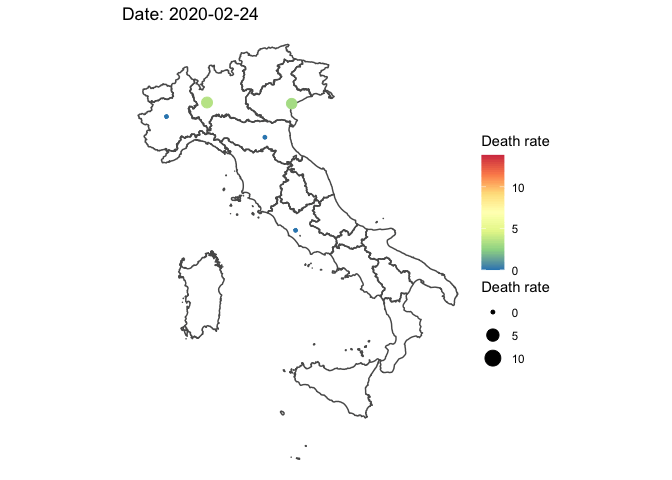

Dataset source: [github repository of the Department of Civil Protection](https://github.com/pcm-dpc/COVID-19)

## Setup
```{r message=FALSE}
library(tidyverse)
library(lubridate)
library(sf)
library(gganimate)

data_file <- '~/Downloads/COVID-19/dati-regioni/dpc-covid19-ita-regioni.csv'
shape_dsn <- '~/Downloads/italian-maps-shapefiles/italy-with-regions/'

df <- read_csv(data_file)
shape <- read_sf(dsn = shape_dsn)
```

It is also helpful to reorder the regions based on north-south scale.

```{r}
df <- df %>% mutate(distance = sqrt(lat^2 + long^2), 
                    regions = fct_reorder(denominazione_regione, desc(distance)))
```

Since the hour information is useless, let's remove it

```{r}
df <- df %>% mutate(date = date(data)) %>% select(-data)
```

Now, I need to convert the dataset into simple features collection supplying the `long` and `lat` as point coordinates.

```{r}
df_sf <- df %>% st_as_sf(coords = c('long', 'lat'), crs = 4326, agr = 'constant')
```

And some settings for the plots
```{r}
theme_set(theme_minimal())
theme_update(legend.position = 'bottom')
options(ggplot2.continuous.colour = 'Spectral')
options(ggplot2.continuous.fill = 'Spectral')
myColourPalette <- c('#67001f','#b2182b','#d6604d','#f4a582','#fddbc7','#f7f7f7','#d1e5f0','#92c5de','#4393c3','#2166ac',
                     '#053061', 'white', '#40004b','#762a83','#9970ab','#c2a5cf','#e7d4e8','#f7f7f7','#d9f0d3','#a6dba0',
                     '#5aae61','#1b7837','#00441b') #from colorbrewer2.org
```

## Plots
### Testing activity and new cases
The capacity to identify confirm cases is limited by the testing capacity; therefore, it helps to look at both testing and positive cases simultaneously, whether in absolute or relative terms. 

```{r}
df %>% select(date, regions, tamponi, nuovi_attualmente_positivi) %>% 
  group_by(regions) %>% 
  arrange(date) %>% 
  mutate(new_tests = tamponi - lag(tamponi, 1)) %>% 
  ungroup() %>% select(-tamponi) %>% 
  gather(key = 'variable', value = 'value', -regions, -date) %>% 
  mutate(variable = ifelse(variable == 'new_tests', 'New tests', 'New positive cases')) %>% 
  ggplot(., aes(x = date, y = value/1000, colour = variable)) + geom_point() + geom_line() + 
  facet_wrap(~regions, scales = 'free_y') + 
  theme(axis.text.x = element_text(angle = 90)) + 
  labs(x = 'Date', y = 'thousands', colour = '') + 
  scale_colour_brewer(palette = 'Set1')
```

```{r}
df %>% mutate(positive_share = totale_attualmente_positivi/tamponi) %>% 
  ggplot(., aes(x = date, y = positive_share*100, colour = 'Positive cases as a share of total tested')) + 
  geom_point() + geom_line() + 
  facet_wrap(~regions, scales = 'free_y') + 
  theme(axis.text.x = element_text(angle = 90)) + 
  labs(x = 'Date', y = '%')
```

But it is still difficult to make conclusions because of selection issues. 
And increase in the share of positive cases in all tested may either of the two:

- more people are getting infected
- tests are given to those most likely to have the virus.

### Death rate and new death cases
```{r}
df %>% mutate(death_rate = deceduti/totale_casi) %>% 
  ggplot(., aes(x = date, y = death_rate*100, colour = 'Death rate')) + geom_point() + geom_line() + 
  facet_wrap(~regions, scales = 'fixed') + 
  theme(axis.text.x = element_text(angle = 90)) + 
  labs(x = 'Date', y = '%', colour = '')
```

```{r}
df %>% group_by(regions) %>% arrange(date) %>% 
  mutate(new_death = deceduti - lag(deceduti, 1)) %>% 
  ungroup() %>% 
  ggplot(., aes(x = date, y = new_death, fill = regions)) + geom_bar(position = 'stack', stat = 'identity') + 
  scale_fill_manual(values = myColourPalette) + 
  labs(x = 'Date', y = 'New death cases', fill = 'Regions')
ggsave(filename = 'featured.png')
```

### Timeline on a map

```{r message=FALSE, results='hide', warning=FALSE}
ndays <- min(df$date) %--% max(df$date) / ddays(1) + 1
map <- df_sf %>% 
  mutate(death_rate = deceduti/totale_casi) %>% 
  ggplot(.) + 
  geom_sf(data = shape, fill = NA) + 
  geom_sf(aes(color = death_rate*100, size = death_rate*100)) + 
  theme_void() + 
  labs(title = 'Date: {frame_time}', colour = 'Death rate', size = 'Death rate') + 
  scale_colour_distiller(palette = 'Spectral') + 
  transition_time(date) 
#animate(map, nframes = 30, renderer = gifski_renderer('map_png/map_anim.gif'))
animate(map, nframes = ndays, fps = 30, renderer = file_renderer('map_png/', overwrite = TRUE))
gifski::gifski(list.files('map_png/', full.names = 'TRUE'), gif_file = 'map_anim.gif')
```


